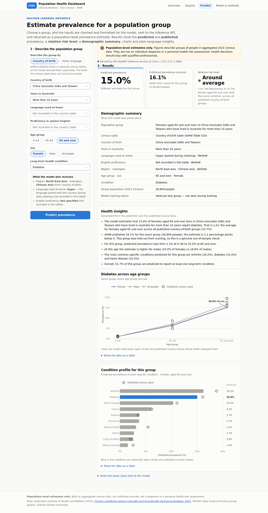

# LTHC Population Health Dashboard

The dashboard stage of the PRT661 project, built to the **Final Project Architecture**: a **Plotly Dash** dashboard
that calls a **FastAPI** machine-learning inference API, both hosted on **Render**. It turns the cleaned AIHW data and
the XGBoost model from the `Machine_Learning` branch into the two things the project objectives promised: key findings
from the exploratory analysis, and population-level prevalence predictions.



## Pages

| Page | What it shows |
|---|---|
| **Overview** (`/`) | Headline findings with charts and data tables: age, sex, region of birth, years in Australia, and the leading condition by region and sex. |
| **Explore** (`/explore`) | Weighted prevalence of any condition compared by age, sex, region, subregion, country of birth, home language, years in Australia or English proficiency, with filters and a condition-profile heatmap. |
| **Predict** (`/predict`) | The deployment phase of the workflow: pick a population group and get predicted prevalence, the published census value, a relative risk level, a demographic summary, charts and insights. |
| **Model & methods** (`/model`) | Test-set performance of the four models, overfitting check, feature importance, predicted vs published values, pipeline, limitations and ethics. |

### How the Predict page follows the workflow diagram (deployment phase)

| Workflow step | In the dashboard |
|---|---|
| Selects parameters for population group (country of birth, age group, sex, years in Australia, language, English proficiency, LTHC) | The form shows all seven parameters. |
| Validate and preprocess selected parameters, format them for the AI model | `prediction.validate_request` and `prediction.build_model_input` check the inputs and build the nine model features the way the training rows were built (see *Census tables* below). The exact input sent is shown under the results. |
| Load the formatted data into the model | `inference.InferenceClient` posts to the FastAPI service (`/predict/batch`). |
| Predict population-level LTHC prevalence (%) | XGBoost model, clipped to 0–100%. |
| Display results: predicted prevalence, observed prevalence, risk level, demographic summary | Three result tiles plus the demographic summary card. |
| Generate data visualisations and produce health insights | Age-by-sex trajectory, condition profile and generated plain-language insights. |

## Run it locally (Python 3.11)

```bash
cd Dashboard
python -m venv .venv
source .venv/bin/activate          # Windows: .venv\Scripts\activate
pip install -r requirements-dev.txt

# Terminal 1 - inference API (http://127.0.0.1:8000/docs for the Swagger UI)
uvicorn api.main:app --port 8000

# Terminal 2 - dashboard (http://127.0.0.1:8050)
export LTHC_API_URL=http://127.0.0.1:8000     # PowerShell: $env:LTHC_API_URL="http://127.0.0.1:8000"
python app.py
```

Without `LTHC_API_URL` the dashboard uses its bundled copy of the same model, and the Predict page says which one
served each prediction. If the API is set but unreachable (a sleeping free Render instance, for example), the dashboard
falls back to the bundled model and says so.

Run the tests with `python -m pytest` from the `Dashboard` folder.

| Environment variable | Default | Purpose |
|---|---|---|
| `LTHC_API_URL` | empty | Base URL of the FastAPI service |
| `LTHC_API_TIMEOUT` | `10` | Seconds to wait for the API before using the bundled model |
| `LTHC_DATA_DIR`, `LTHC_MODELS_DIR` | `data/`, `models/` | Override file locations |

## Deploy on Render

`render.yaml` in the repository root is a Render Blueprint that creates both services from this folder on the `GUI`
branch.

1. Push the `GUI` branch to GitHub.
2. In Render: **New + → Blueprint**, connect the repository, select the `GUI` branch and apply.
3. When asked for `LTHC_API_URL`, enter the API's public URL (normally `https://lthc-api.onrender.com`; check the URL
   Render gives the `lthc-api` service and update the variable under the dashboard's *Environment* settings if it
   differs). It can be left empty at first.
4. Open the `lthc-dashboard` URL. The Predict page reports "Served by the FastAPI inference service" once connected.

Free Render services sleep when idle and can take about a minute to wake; the dashboard pings the API as it starts so both wake together, and uses its bundled model for any request made before the API is up. Each service uses about 200 MB of memory,
within the free tier's 512 MB. The Python version comes from `.python-version` (3.11).

## Folder structure

```
Dashboard/
├── app.py                  Dash entry point (gunicorn app:server)
├── api/main.py             FastAPI service: /, /health, /predict, /predict/batch
├── pages/                  overview.py, explore.py, predict.py, model.py
├── lthc_dashboard/
│   ├── config.py           paths, environment settings, column names, category lists
│   ├── data.py             loading, census-table tagging, train/test split, weighted prevalence
│   ├── analysis.py         descriptive tables for Overview and Explore
│   ├── model.py            loads the preprocessor + XGBoost model (shared by API and dashboard)
│   ├── inference.py        API client with fallback to the bundled model
│   ├── prediction.py       Predict-page logic: validation, inputs, benchmark, risk level, insights
│   ├── figures.py          Plotly charts
│   ├── components.py       layout pieces (cards, tiles, tables, notices)
│   └── theme.py            colours and Plotly template
├── assets/style.css
├── data/                   LTHC_phase2_cleaned.csv + evaluation outputs (from Machine_Learning/Attempt_2)
├── models/                 lthc_preprocessor.pkl, xgboost_regression_model.pkl (from Fast_API/models)
├── tests/                  57 tests
└── docs/screenshots/
```

`data/` and `models/` are unchanged copies of files on the `Machine_Learning` branch. The preprocessor was pickled with
scikit-learn 1.8.0, so that version is pinned. `api/main.py` keeps the endpoints, request fields and response keys of
`Fast_API/api/main.py`, and adds `/predict/batch`, an `unseen_inputs` field and file paths that work from any
directory.

## Method notes

- **Weighted prevalence.** Every descriptive figure is pooled cases ÷ pooled population for the group, as in the
  Assessment 2 report. The tests check that it reproduces the report's figures (for example female arthritis by age:
  0.93%, 10.70%, 33.03%).
- **No double counting.** "Persons" is the Male + Female total, so when sex is not the comparison only Persons rows are
  used, following the report's univariate rule. The report's region heatmap pooled Persons with Male and Female rows,
  so a few region figures differ slightly (Southern and Eastern Europe arthritis: 15.5% here, 16.3% in the report).
- **Census tables.** AIHW publishes country of birth + years in Australia (Table S10) separately from home language +
  English proficiency (Table S13). Every cleaned row comes from exactly one table, so:
  - comparisons by country or years in Australia use Table S10 only, and comparisons by language or English
    proficiency use Table S13 only;
  - the Predict form locks the fields the chosen table does not record, and fills them the way the training rows were
    filled (the paired language or country from cleaning, and "Not specified").
- **Crude rates.** "All ages" comparisons are crude. The age filter gives like-with-like comparisons.
- **Relative risk level.** Predicted prevalence ÷ benchmark, where the benchmark is the weighted prevalence for the same
  condition, age group and sex across all published groups in the same census table. Below 0.8× is below average,
  0.8–1.25× around average, 1.25–2× above average and 2× or more well above average.
- **Training status.** The group-aware split (`GroupShuffleSplit`, `test_size=0.2`, `random_state=42`) is recreated
  exactly, so each result says whether the group was held out from training.

## Data-quality note for the team

The language–country pairings made during cleaning are often not the most common language: China → Uygur,
India → Kannada, Philippines → Bisaya, England → "Northern European Languages, nfd", New Zealand → Māori, and in the
other direction Arabic → Saudi Arabia and Spanish → Spain. The model was trained on these pairings, so the dashboard
uses them unchanged and shows them as "derived". Fixing the mapping would mean re-running cleaning and retraining.
The language-table rows' regions also come from these pairings.
